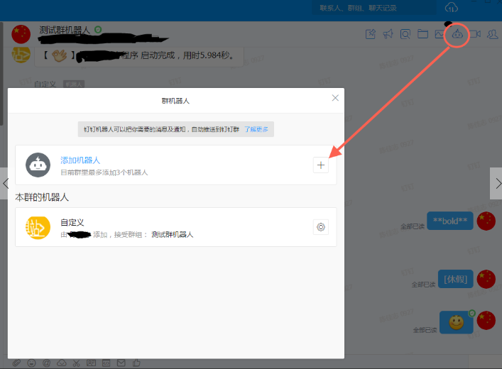
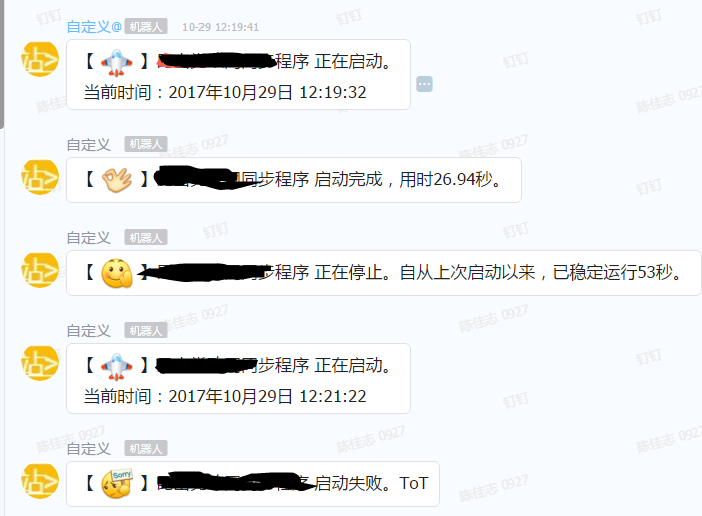

# 使用方式

**注意**：本机必须安装jdk8和maven

1.克隆到本地。
```
git clone https://github.com/chenjazz/DingTalkMachineWithSpringBoot.git
```
进入项目目录，安装到本地maven库。
```
mvn clean install
```


2.在你的SpringBoot项目Pom中加入本项目依赖
```
<dependency>
    <groupId>com.github.chenjazz</groupId>
    <artifactId>spring-boot-dingtalk-machine</artifactId>
    <version>1.0.0</version>
</dependency>
```

3.在钉钉群中添加自定义机器人，并取得webhook url



4.启动你的项目项目时指定参数
```
nohup java -jar your-project-1.jar --ding-url={自定义机器人webhook} --ding-app-name={你的应用程序名字} &
```

5.程序启动，关闭（kill的参数不为-9），成功，失败后会自动通知，效果如下


